# JIT-Compose

**Evolving Multi-Agent Workflow Synthesis for Open-Ended Generation**

JIT-Compose (Just-in-Time Composition of Agent Teams and Workflows) is an
experience-driven framework for constructing a task-specific
multi-agent writing workflow and improving the experience used to construct later
workflows. It keeps the model parameters and evaluator fixed. What changes across
tasks is versioned synthesis experience: predicted requirements, organization
decisions, and reusable agent harness profiles.

> This repository is a working research implementation. The formal benchmark
> campaign is not complete, and the result tables are intentionally unfilled.
> Software tests and bounded pilots are implementation evidence, not performance
> claims.

```mermaid
flowchart LR
    subgraph TASK[Per EVO task]
        Q["Public task"] --> R["Rubric graph<br/>requirements and evidence expectations"]
        R --> P["Global/local planning<br/>TeamSpec, roles, dependencies, budget"]
        P --> C["Compose workflow<br/>Agent Pool or task-local profiles"]
        C --> E["Execute<br/>shared ledger and Writer"]
        E --> S["Hash and freeze submission"]
        S --> J["Independent evaluation"]
        J --> A["Alignment and attribution<br/>global + local evidence"]
    end
    subgraph BATCH[Batch-end evolution]
        A --> K["Aggregate 5 EVO records<br/>same frozen input state"]
        K --> U["Generate 3 candidate states"]
        U --> V["10 fixed VAL per candidate<br/>read-only"]
        V --> W["Select one winner"]
    end
    W -->|next batch state| Q
    T["Held-out TEST / transfer<br/>read-only, no updates"] -.-> S

    classDef state fill:#eef2ff,stroke:#4f46e5,color:#111827;
    classDef stage fill:#f8fafc,stroke:#64748b,color:#111827;
    class Q,R,P,C,E,S,J,A,K,U,V,W,T stage;
    class W,U state;
```



In the registered batch protocol, the five EVO tasks in a batch share one frozen
state and do not write to experience or the Agent Pool. Candidates are generated
after the batch, VAL selects the winner, and TEST remains read-only.

## Method

For each public task, JIT-Compose runs the following loop:

1. **Predict requirements.** Meta predicts task-specific quality requirements,
   importance, confidence, evidence expectations, applicability, and their typed
   relationships as a rubric graph.
2. **Plan the team.** Global and local planning turn those requirements into a
   `TeamSpec` with roles, rubric responsibilities, inputs, outputs, dependencies,
   tools, verification responsibilities, and a resource-aware budget plan.
3. **Compose the workflow.** The system selects and adapts reusable full-agent
   harness profiles from the Agent Pool. If no profile fits, it can record a
   complete task-local profile. The selected profiles and team design are frozen
   before execution.
4. **Execute and submit.** The default executor uses a single-pass structured
   shared ledger: Analyst and Evidence roles contribute requirements, outlines,
   source spans, and provenance; the Writer reads the completed ledger once and
   submits the artifact. `iterative_shared_ledger` is available when a registered
   run needs bounded follow-up calls. A submitted artifact is hashed and frozen
   before evaluation feedback is released.
5. **Attribute feedback.** Independent criterion-level evaluation is aligned with
   the frozen predicted requirements and the observed coordination records. Meta
   performs global analysis; each agent receives a validated, scoped rubric subset
   for local attribution and reflection. These records are evidence-linked
   hypotheses, not causal proof.
6. **Evolve directly.** After attribution, structurally valid proposals update
   versioned experience atomically. There is no accept/hold/reject quality gate or
   paired-validation promotion step. The Agent Pool may add, prune, split, merge,
   specialize, or reorganize reusable harness profiles. Held-out validation and
   test tasks are read-only and never update either layer.

The construction stage does not perform attribution or modify the persistent Pool.
Pool operations and profile updates happen only after a complete evolution task or
batch has been evaluated. See the [implementation guide](docs/jit_mas.md) and the
[single-pass executor contract](docs/jit_mas_single_pass.md) for the precise
contracts and limits.

## Registered evaluation protocol

The current overview is the independent, empty-start protocol in
[`paper/experiments/experiment_plan_v5_ZH.md`](paper/experiments/experiment_plan_v5_ZH.md):

- ResearchRubrics, DeepSearchQA, and WritingBench each start with an empty
  experience store and Agent Pool state.
- Each source has three fixed order runs. Every trajectory contains 40 evolution
  tasks in eight batches of five. The five tasks in a batch share one frozen input
  state; no experience or Pool update occurs between them.
- After a batch, Meta produces three candidates from the same batch input. Each
  candidate is evaluated on the source's fixed ten validation tasks, and the
  registered selection rule chooses one winner for the next batch. The final
  selected state is the eighth-batch winner (`C40`).
- DeepResearch Bench II, IFEval, and IFBench are test-only transfer targets. Test
  feedback cannot affect evolution or selection, and the sources are reported
  separately rather than as one cross-benchmark leaderboard.

The registered inventory is 360 evolution slots, 2,160 validation slots, and
2,751 test slots (5,271 nominal task slots), plus 216 candidate-generation
operations. These are task slots or planned operations, not API-request or
completed-work guarantees. Exact task IDs,
hashes, budgets, and release conditions live under
[`paper/experiments/`](paper/experiments/). No formal performance result should be
inferred until the complete test inventory is sealed and scored.

## Repository layout

| Directory | Purpose |
|---|---|
| [`jit_mas/`](jit_mas/) | JIT-Compose schemas, planning, execution, attribution, experience, and Agent Pool evolution |
| [`scripts/run_jit_mas.py`](scripts/run_jit_mas.py) | Offline smoke, native evolution, frozen evaluation, freeze, and rollback entry point |
| [`scripts/run_independent_batch_experiment.py`](scripts/run_independent_batch_experiment.py) | Registered batch-campaign runner |
| [`docs/`](docs/) | Implementation, runtime, quality, and protocol notes |
| [`paper/`](paper/) | Manuscript, experiment plans, manifests, and audit records |
| [`benchmark/`](benchmark/) | Benchmark adapters and evaluators inherited from the JIT runtime |
| [`dataset/`](dataset/) | Dataset provenance and preparation helpers; benchmark data is not bundled |
| [`tests/jit_mas/`](tests/jit_mas/) | Offline regression tests and synthetic fixtures |

The original JIT generation and HarnessFactory paths remain in `jit/`,
`harness_factory/`, and `scripts/` as inherited controls and compatibility code.
Their upstream descriptions and results are not results for JIT-Compose.

## Quick start

Use Python 3.11 or later. Create an environment with either:

```bash
conda env create -f environment.yml
conda activate jit
```

or:

```bash
python -m venv .venv
# activate .venv using the shell for your platform
python -m pip install -r requirements.txt
```

Copy `.env.example` to `.env` when using hosted models. The native JIT-MAS
configuration uses five independent `MAS_*` roles (Meta, Global, Local, Exec, and
Judge); the complete endpoint, key, timeout, and token settings are documented in
[`configs/jit_mas.native.example.yaml`](configs/jit_mas.native.example.yaml).

### Offline verification

The smoke path uses synthetic fixtures and makes no paid requests, downloads, or
parameter updates:

```bash
python -m pytest tests/jit_mas -q
python -m scripts.run_jit_mas \
  --mode smoke \
  --state outputs/smoke/experience.sqlite \
  --output outputs/smoke/runs
```

Smoke verifies the wiring for planning, harness reuse, shared-ledger execution,
evaluation, attribution, and atomic dual evolution. It does not estimate benchmark
quality.

### Small native run

Prepare the pinned ResearchRubrics data separately, configure the five `MAS_*`
roles, and use the example config:

```powershell
python -m scripts.prepare_researchrubrics --download --output-dir dataset/researchrubrics-local --seed 0 --evolution-size 5 --validation-size 0
python -m scripts.run_jit_mas --mode evolve --config configs/jit_mas.native.example.yaml --data dataset/researchrubrics-local/processed_data.jsonl --splits dataset/researchrubrics-local/splits.json --state outputs/native/experience.sqlite --output outputs/native/runs --limit 1 --unsafe-local
python -m scripts.run_jit_mas --mode evaluate --config configs/jit_mas.native.example.yaml --data dataset/researchrubrics-local/processed_data.jsonl --splits dataset/researchrubrics-local/splits.json --state outputs/native/experience.sqlite --output outputs/native/test --limit 1 --unsafe-local
```

`--unsafe-local` is required because this checkout does not include a trusted
generated-code sandbox. Use a disposable environment with no sensitive files or
credentials. Native runs are implementation checks, not formal campaign results.

### State and artifacts

```powershell
python -m scripts.run_jit_mas --mode freeze --state outputs/native/experience.sqlite --output outputs/native/frozen-v1.json
python -m scripts.run_jit_mas --mode rollback --state outputs/native/experience.sqlite --version 0
```

Run directories retain frozen plan hashes, generated harness and profile
identities, execution traces, immutable submissions, per-criterion evaluation,
alignment and attribution, reflection and Pool decisions, update receipts, and
budget records. `freeze` and `rollback` operate on Meta experience, full harness
profiles, and Pool structure as one versioned snapshot.

## Data and inherited controls

Only synthetic JIT-MAS fixtures are included. Obtain real benchmark data from the
upstream sources and follow their licenses; see [`dataset/README.md`](dataset/README.md)
for provenance and checks.

The inherited JIT runner remains available for compatibility:

```bash
python -m scripts.run_seed_harness --bench xbench --list-harnesses
python -m scripts.run_seed_harness --bench xbench --harness plan_and_execute --max-samples 5
python -m scripts.run_jit --bench xbench --meta-model provider-model --meta-base https://api.provider.com/v1 --selector judge --rollouts 3 --max-samples 5
```

Those commands exercise the original JIT/HarnessFactory pipeline. They are useful
controls and smoke paths, but they do not run the JIT-Compose evolution loop.
Detailed component documentation is available in [`jit/README.md`](jit/README.md),
[`harness_factory/README.md`](harness_factory/README.md), and
[`scripts/README.md`](scripts/README.md).

## Citation

The manuscript title is **JIT-Compose: Evolving Multi-Agent Workflow Synthesis for
Open-Ended Generation**. Citation metadata will be finalized with the paper
release. Do not cite the inherited upstream JIT-Agent paper as a result for this
method.

## License

See [LICENSE](LICENSE).
