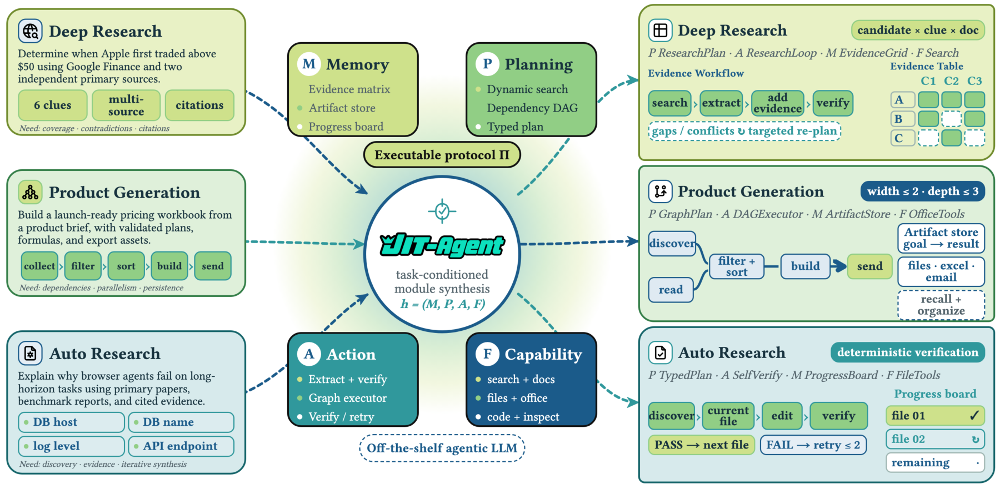
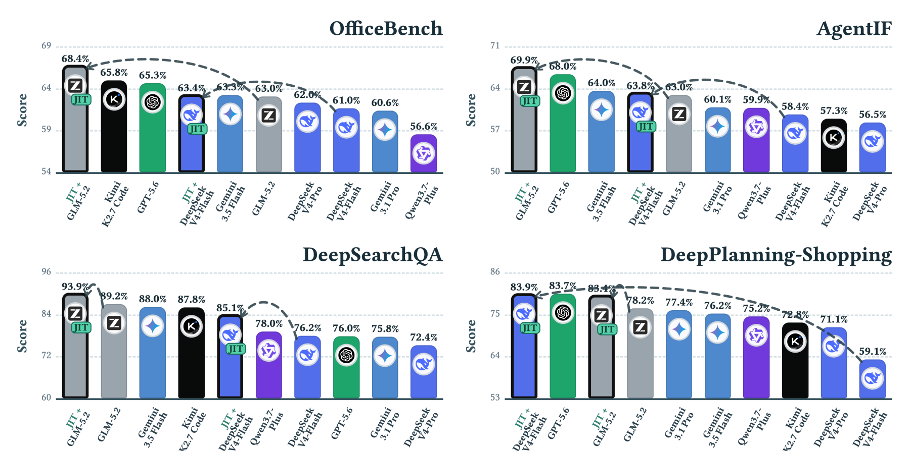

<div align="center">


**Scaling Harness Intelligence via *Just-in-Time* Harness Evolution**

[](https://github.com/bingreeky/JIT)
[](https://arxiv.org/abs/2608.25593)
[](https://huggingface.co/JIT-Agent)
[](LICENSE)

</div>

## JIT-Rubric-MAS

This repository extends [upstream JIT](https://github.com/bingreeky/JIT) with
rubric prediction, task-conditioned team planning, execution, attribution, and
direct, versioned experience updates after attribution (without an accept/hold/reject quality gate). See [the extension guide](docs/jit_mas.md).
Task execution uses single-pass shared-ledger coordination: task-conditioned
Analyst/Evidence contributions feed a deterministic ledger, and the Writer reads
the completed snapshot once before independent evaluation. Each execution role
has at most one model call, with no task-level message loop. See the
[executor contract and migration guide](docs/jit_mas_single_pass.md).
The original JIT description and results below belong to the upstream project;
they are not performance claims for this extension.

This public source distribution excludes benchmark data, credentials, local
environments, and run outputs. Dataset helpers and provenance remain in
[`dataset/`](dataset/); acquire benchmark data separately from its upstream
sources and follow their licenses. Synthetic tests in `tests/jit_mas/fixtures/`
are included, so offline verification does not require those downloads.


## What is JIT-Agent?

**JIT-Agent is a compact meta-agent that writes your agent harness on the fly.** Instead of
precompiling one general-purpose scaffold and hoping it transfers, JIT-Agent takes a task
spec, a protocol, a tool/skill registry, and a few retrieved prior harnesses, and emits an
**executable, task-specific harness that wraps any off-the-shelf agentic LLM** —
***Model-as-a-Harness***.

<div align="center">

</div>

<div align="center"><sub><b>Overview of JIT-Agent.</b> Given a task, JIT-Agent composes a
problem-specific agent harness by selecting and instantiating four modules: memory,
planning, action, and capability. Different task structures therefore induce distinct
executable protocols and state organizations.</sub></div>

Every harness is factored into **four modules — memory, planning, action, capability
orchestration** — implemented against the shared interfaces in
[**HarnessFactory**](harness_factory/), so generation means **emitting structured code
rather than free-form agent programs**. As traces and feedback come back, JIT-Agent revises
the harness and updates the archive: **harnesses keep improving at test time while the
generator itself stays frozen.**

<div align="center">

</div>

**Results.** The resulting **JIT-Agent-27B** lifts a wide range of backbone agents across
deep research, daily work, planning, and workspace tasks.

> **Building the scaffold turns out to be a trainable, transferable axis of agent
> intelligence — orthogonal to scaling the base model.**

---

## Repository layout

| Directory | What it holds |
|---|---|
| [`jit/`](jit/) | The meta agent: generation / repair prompts, best-of-N selection |
| [`scripts/`](scripts/) | The agent kernel, tools, models, evaluation engine, and the two runners |
| [`harness_factory/`](harness_factory/) | Hand-written harness implementations and their design write-ups |
| [`benchmark/`](benchmark/) | One adapter, config and evaluator per benchmark |
| [`dataset/`](dataset/) | Dataset helpers and download/provenance documentation |

Each directory has its own README with the details.

## JIT-MAS extension

The incremental rubric-driven team loop, offline smoke, pinned ResearchRubrics adapter,
and small native-run instructions are documented in [docs/jit_mas.md](docs/jit_mas.md).
Run `python -m scripts.run_jit_mas --mode smoke` for synthetic software verification.
This does not run a real benchmark, call paid APIs, or train model parameters.

The [registered three-benchmark plan](paper/experiments/benchmark_plan_v3_ZH.md)
covers ResearchRubrics, DeepSearchQA, and frozen transfer to DeepResearch Bench II.
It includes fixed public-ID manifests, full-validation checkpoint selection,
shared evidence packs, metered benchmark-specific judges, and sealed test
submission before feedback release. Run
`python -m scripts.run_benchmark_experiment --mode evolve --smoke --output outputs/checkpoint_smoke`
and `python -m scripts.run_benchmark_test --mode smoke --campaign outputs/test_smoke`
to verify these paths offline. Formal model results have not been collected.

## Setup

**1. Clone the repository**

```bash
git clone https://github.com/chivector/JIT-Rubric-MAS.git
cd JIT-Rubric-MAS
```

**2. Environment** (Python 3.11)

```bash
conda env create -f environment.yml && conda activate jit
```

or, in an existing environment: `pip install -r requirements.txt`. Serving a local meta
model (vLLM/SGLang + torch) is deliberately not included — the pipeline only ever talks
HTTP to it.

**3. Credentials**

```bash
cp .env.example .env   # then fill it in
```

Anything already exported in the shell wins over `.env`, and every model role can also be
overridden per run on the command line.

| Group | Keys | Used for |
|---|---|---|
| Execution model | `OPENAI_API_BASE`, `OPENAI_API_KEY`, `EXEC_MODEL` | runs the generated harness's agent loop |
| Judge model | `JUDGE_MODEL`, optional `JUDGE_API_*` | grades produced artifacts (falls back to the execution endpoint) |
| Meta model | `META_MODEL`, `META_API_BASE`, `META_API_KEY`, `META_TOKENIZER` | writes the harness (JIT pipeline only) |
| Tools | `SERPER_API_KEY`, `JINA_API_KEY` | `web_search` / `crawl_page` |

**4. Data**

Only synthetic JIT-MAS test fixtures ship in this fork. Real benchmark data must
be obtained separately; see [dataset/README.md](dataset/README.md) for sources.
The fetch script covers the large assets described in the upstream guide.

```bash
python scripts/check_datasets.py        # present / partial / missing, per benchmark
bash scripts/fetch_datasets.sh travel   # one benchmark ("all" ≈ 1 GB)
```

## Usage

All modes share the same benchmark adapters, execution model, judge, and scoring path.
The **meta model** writes a harness, the **execution model** runs it, and the **judge
model** grades the result. Configure credentials in `.env`; CLI flags override them.

| Goal | Entry point | Meta model | Selection |
|---|---|---|---|
| Test a fixed HarnessFactory design | `scripts.run_seed_harness` | None | None |
| Use a hosted API as the meta-agent | `scripts.run_jit` | OpenAI-compatible API | `judge` |
| Evaluate the JIT checkpoint | `serve_meta_model.sh` + `scripts.run_jit` | Local JIT-27B | `logprob` |

**1. Test a fixed HarnessFactory design.** No meta model is called; the selected harness
is executed and scored directly.

```bash
python -m scripts.run_seed_harness --bench xbench --list-harnesses
python -m scripts.run_seed_harness --bench xbench \
    --harness plan_and_execute --max-samples 5
```

See the [HarnessFactory guide](harness_factory/README.md) for the eleven included designs.

**2. Use a hosted API model as the meta-agent.** Hosted APIs usually do not expose
`prompt_logprobs`, so use judge selection explicitly. `META_API_KEY` is read from `.env`.

```bash
python -m scripts.run_jit --bench xbench \
    --meta-model provider-model --meta-base https://api.provider.com/v1 \
    --selector judge --rollouts 3 --max-samples 5
```

**3. Evaluate the JIT checkpoint.** Serve the checkpoint, then use its tokenizer for the
published log-probability selector.

```bash
MODEL=JIT-Agent/jit-27b SERVED_NAME=jit TP=4 \
    bash scripts/serve_meta_model.sh
```

```bash
python -m scripts.run_jit --bench xbench \
    --meta-model jit --meta-base http://127.0.0.1:8000/v1 \
    --selector logprob --tokenizer JIT-Agent/jit-27b \
    --rollouts 3 --meta-temperature 1.0 --max-samples 5
```

Drop `--max-samples` for a full run. `MODEL` may also be a local checkpoint path;
`SERVED_NAME` must match `--meta-model`. The shell wrapper
`bash scripts/run_jit.sh xbench` reads the same settings from the environment.

**Key arguments**

| Arguments | Purpose |
|---|---|
| `--bench`, `--dataset-path` | Select the benchmark and optionally override its data path. |
| `--meta-model/base/key` | Configure the harness-generating model; JIT runs only. |
| `--exec-model/base/key` | Configure the model that runs the harness. |
| `--judge-model/base/key` | Configure the benchmark evaluator. |
| `--rollouts`, `--meta-temperature` | Control candidate count and generation diversity. |
| `--selector`, `--tokenizer` | Use `judge` for hosted APIs or `logprob` with a local tokenizer. |
| `--harness-refs {desc,code}` | Choose design descriptions or sampled source harnesses as references. |
| `--max-samples`, `--cases`, `--output` | Control smoke tests, case selection, and output location. |
| `--workers-gen`, `--workers-exec` | Tune generation and execution concurrency independently. |

Supported benchmarks are `xbench`, `deepsearchqa`, `agentif`, `officebench`, `odyssey`,
`shopping`, and `travel`.

**Output and resume.** JIT runs separate generation, selection, and execution artifacts:

```
summary.json    headline metrics + how the run was configured
generate/       the N candidate harnesses per case, with prompts and responses
select/         the pick per case, the rule that produced it, per-candidate scores
execute/        the harness that actually ran, its trajectory, and the numbers you report
```

Fixed-harness runs write `summary.json`, `scores.jsonl`, and per-case reports directly.
Re-running an identical command resumes completed work and retries only infrastructure
failures; `--skip-generate` and `--skip-select` reuse earlier JIT phases.

Detailed documentation: [JIT pipeline](jit/README.md) ·
[HarnessFactory](harness_factory/README.md) · [CLI and runtime](scripts/README.md).
Run either entry point with `--help` for the full flag list.

## Citation

If you find JIT-Agent useful, please cite:

```bibtex
@misc{zhang2026jitagentscalingharnessintelligence,
      title={JIT-Agent: Scaling Harness Intelligence via Just-in-Time Harness Evolution},
      author={Guibin Zhang and Leo Lu and Fangzhou Xie and Kang Zhu and Junhao Wang and Zhifei Xie and Zhaochen Yu and Zihang Liu and Zhongxiang Sun and Qiankun Li and Yue Liao and Heng Chang and Xiaobin Hu and Qibing Ren and Wangchunshu Zhou and Shuicheng Yan},
      year={2026},
      eprint={2608.25593},
      archivePrefix={arXiv},
      primaryClass={cs.CL},
      url={https://arxiv.org/abs/2608.25593},
}
```

## License

See [LICENSE](LICENSE).
