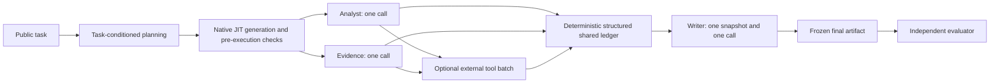

# Single-pass task execution

This document applies to `execution_mode: single_pass`, the default execution mode.
The optional `iterative_shared_ledger` mode has a separate repeated-call contract
described in the [implementation guide](jit_mas.md). Pool reuse and dual evolution
apply to both modes; the pooled path installs the existing MAS scaffold instead
of generating new harness Python for each task.

This is an incremental executor contract for JIT-MAS, not a replacement MAS
framework. Requirements, capabilities, rubrics and generated harnesses remain
task-conditioned. The native five-file JIT generation, selection and loading path
is retained. Historical run artifacts and published experiment results are not
rewritten to describe this contract.

## Execution contract

The analyst writes task requirements and an outline to a structured shared ledger; the evidence agent writes source spans and provenance; the writer reads the completed ledger once and synthesizes the final artifact.

Analyst, Evidence and Writer describe execution functions, not a permanent
domain-specific team. Analyst and Evidence are independent and may run in
parallel by default. Small tasks may combine functions. Genuine forward data
dependencies remain valid, but must not introduce a return-to-agent conversation
or a second writer pass.



Single-pass coordination; no iterative negotiation.

The shared knowledge ledger contains `requirements`, `outline`, `evidence_spans`,
`source_references`, individual `contributions`, and raw `tool_evidence`.
Its merge is deterministic, not another model call or an agreement vote. Source
references and spans preserve provenance; their presence alone does not prove
that a claim is true. The structured knowledge ledger is distinct from the
`BudgetLedger` that meters model and tool usage.

Every execution role has at most one model invocation. A contributor may request
one batch of permitted external tools in that invocation. Tool results are added
to the ledger automatically; the contributor is not called again to interpret
them. Once the contributions and permitted tool results are complete, the Writer
receives the complete read-only snapshot once. Its runtime instruction is:

> Read the structured shared ledger once, synthesize the final response from the analyst requirements and evidence spans, and do not initiate additional inter-agent communication.

There are no agent message queues or `send_message`, `read_evidence`, or
`raise_issue` operations in task execution. The Writer uses only the terminal
completion/submission protocol (`complete` or `final_answer` as permitted by its
role), not external tools. Missing information is reported as a limitation in the
contribution or final artifact; it does not trigger a clarification turn. Honest
checkpoint self-reports remain distinct from independently verified correctness.

## Outer loop and direct experience updates

`local_planning` and `local_rounds` govern pre-execution global/local planning
only. They do not authorize task-execution dialogue, writer revision loops, or
additional execution calls. Domain capabilities and predicted rubrics still shape
the selected roles and their responsibilities before execution is frozen.

After submission, the independent ResearchRubrics evaluator is unchanged. Global
and local attribution may still use their bounded indexed evidence exchange.
The first reconciled proposal is written directly through structural/provenance,
base-version and duplicate guards into an atomic versioned snapshot. There is no
accept/hold/reject quality decision or paired-validation run. Attribution calls
are post-submission analysis, not task-execution communication rounds.

We intentionally exclude iterative inter-agent negotiation to keep executor communication bounded and isolate the effect of evaluator co-evolution.

This sentence states an experimental-design intention, not an implemented or
tested evaluator-co-evolution claim. No SA-RQ, probe miner or reward-kernel
implementation was found in this repository. The API probe is a connectivity and
software smoke tool, not a probe-mining pipeline. The existing evaluator is not
replaced, retrained or silently modified by this executor change.

## Budget and migration

- Existing `max_calls` and team call limits remain general resource ceilings;
  the effective per-execution-role model-call limit is one. Spare team budget
  does not fund a second role turn or an output-format correction call.
- Native JIT generation and bounded pre-execution interface repair remain
  available. Once any execution role model invocation has started, a failure
  cannot trigger harness repair followed by a whole-team replay. Preserve the
  failed attempt and its charged usage instead.
- Existing forward-DAG plans can be adapted without exposing private agent
  histories. Replace interactive requests with structured contributions and
  explicit limitations, and require final synthesis to consume the completed
  ledger snapshot rather than a chain of private messages.
- No new negotiation, clarification or communication-round setting is added.
  Tool permissions, total budgets, public/private evaluator boundaries, native
  loading, full observable sub-runs and exact-hash code review remain required.
- Unsafe-local execution is still host execution, not a sandbox.

## Trace and accounting

`execution.json` retains independent `sub_runs` and publishes `agent_call`,
`shared_ledger_ready`, `shared_ledger_read`, `artifact_published` and `final_answer`
events. It includes the frozen shared ledger and its content hash. There are no
task-level message, issue or evidence-lookup events. A dependency failure blocks
downstream roles rather than waiting for a peer response. Cancellation prevents
new tool dispatches; an already running host function cannot be forcibly stopped.

Each new task run also writes `call_trace.json`: actual role calls, ledger hash,
and the evaluator's settled per-rubric model records. Evaluation failures preserve
the calls already made. Historical cached runs are not given fabricated traces.
Model tokens are charged only by `MeteredModel`; serializing leaf traces or merging
the ledger does not charge them again. Communication bytes count the UTF-8 ledger
snapshot handed to each consumer, once. Prices remain unknown (`cost: null`) when
no pricing source is configured.

## Historical verification (2026-09-30)

The following immutable report predates the 2026-10-01 removal of the experience
quality gate. Its seven-run smoke and promotion language describe that historical
version, not the active direct-update pipeline:

Verified on 2026-09-30 with that runtime frozen:

```powershell
.\.venv\Scripts\python.exe -m pytest tests -q
.\.venv\Scripts\python.exe -m scripts.run_jit_mas --mode smoke --state outputs/single_pass_20260930/experience.sqlite --output outputs/single_pass_20260930/runs
```

- Full suite: **477 tests and 27 subtests passed**. `compileall` and
  `git diff --check` passed.
- CLI smoke: seven harness builds/runs, one source evolution task, two paired
  validation tasks (old/new), and two later fixture tasks. All produced final
  artifacts and complete criterion feedback. Fixture experience version 1 was
  accepted and reused; there were zero paid API requests.
- Six comparison runs each made Analyst/Evidence/Writer calls once. The simple
  poem fixture combined functions into one composer call. Total: **19 execution
  calls and 7 evaluator calls**. The 74 total scripted model invocations include
  planning, harness generation and post-submission attribution. The 165144 ledger
  tokens are synthetic adapter counters, not real API consumption or billing.
- [Smoke audit](../outputs/single_pass_20260930/audit.json) checked all seven runs:
  one Writer ledger read, no old communication events, complete artifacts and
  feedback, model/leaf-token totals matching their records, and zero reserved
  tokens left. Tests also cover real parallelism, malformed ledger/source refs,
  forbidden tool batches before side effects, missing checkpoints, cancellation,
  reentry, no post-start whole-team repair and evaluator failure logging.
- No real API quality benchmark was run for this migration. Earlier real
  `evaluate` results are historical and do not measure this executor or establish
  SA-RQ/evaluator-co-evolution performance.

## Historical executor migration inventory

Runtime and integration:
`jit_mas/execution.py`, `bridge.py`, `planning.py`, `schemas.py`, `config.py`,
`offline.py`, and `pipeline.py`. The pipeline change is trace-only; evaluator,
attribution, experience-validation and promotion decisions were not changed by
this migration. Pre-existing unrelated worktree changes were preserved.

Prompts and configuration:
`harness_factory/descriptions/rubric_mas.md`,
`harness_factory/harnesses/rubric_mas/prompt.yaml`,
`configs/jit_mas.native.example.yaml`, and `configs/jit_mas.scripted.yaml`.

Documentation:
`README.md`, `JIT_to_Rubric_MAS_Codex_Prompt.md`, `docs/jit_mas.md`,
`docs/jit_mas_codebase_audit.md`, `docs/jit_mas_runtime_audit.md`,
`docs/jit_mas_quality.md` (historical-status notice), and this document/diagram.

Tests under `tests/jit_mas/`:
`test_api_probe.py`, `test_bridge_execution.py`, `test_execution_protocol.py`,
`test_execution_quality.py`, `test_model_messages.py`, `test_pipeline.py`,
`test_planning_attribution.py`, and `test_planning_quality.py`.

Final keyword inspection found only explicit prohibitions, regression assertions
and documentation of the removed behavior. The GAM harness's word `clarify`
means explaining source facts, not peer communication, so it is unchanged.
Pre-execution local planning, post-submission attribution follow-ups, outer JIT
generation limits, and cross-task paired validation were retained in that migration.
The separate 2026-10-01 change removes the experience-validation and promotion path.
Historical reports and ignored generated workspaces are not rewritten. No
task-execution negotiation settings or dispatch path remain.
